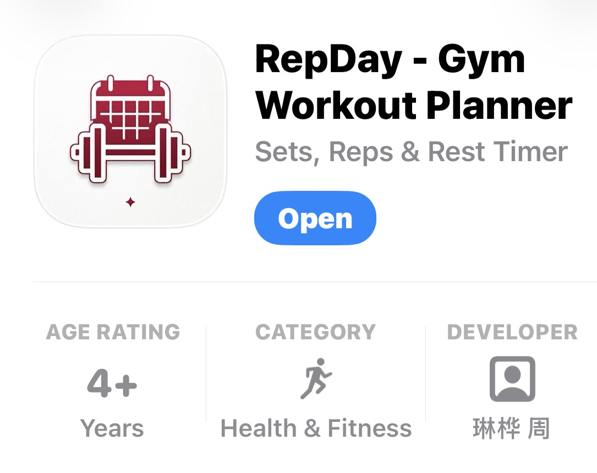
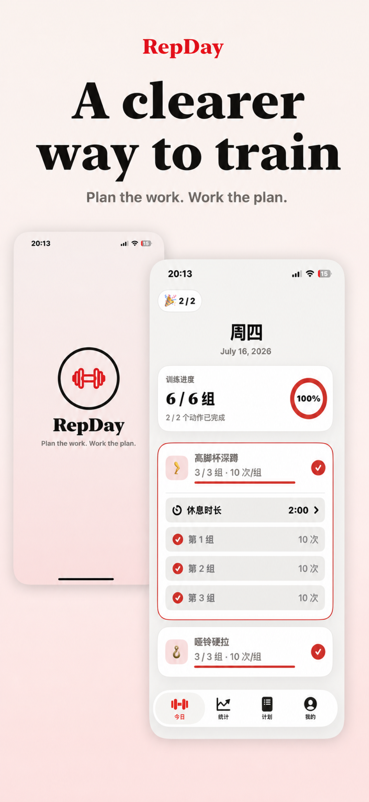
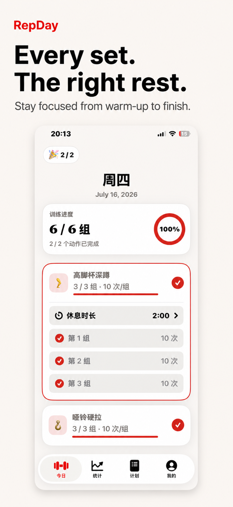
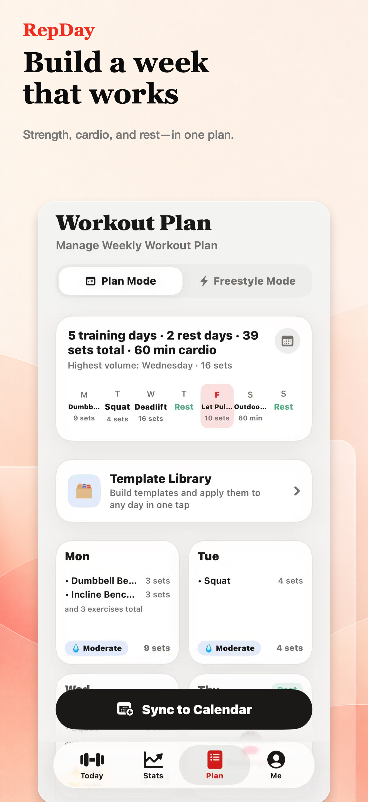
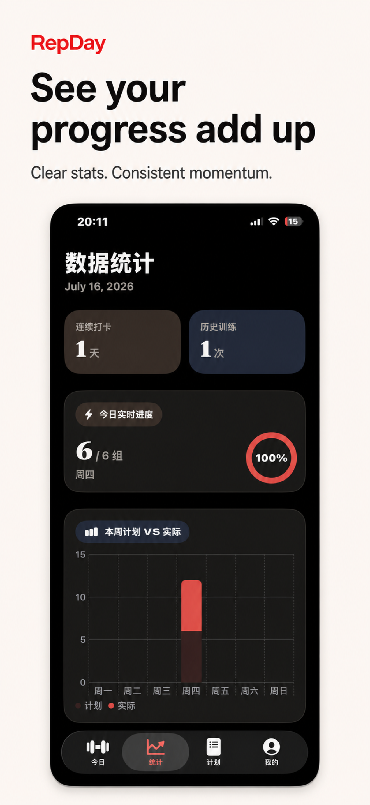
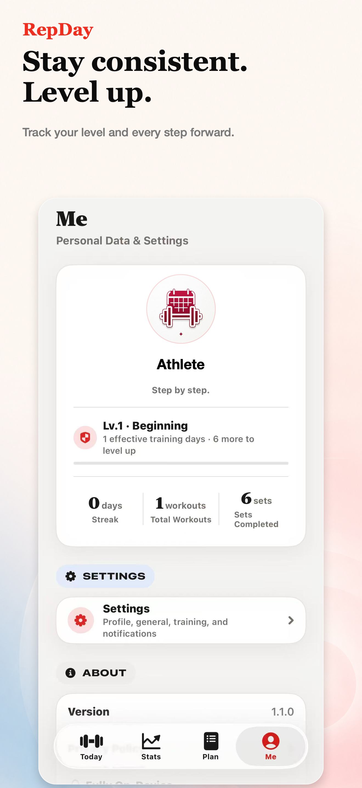

# 🏋️‍♂️ RepDay - Gym Workout Planner

**A clearer way to train. ｜ 更清晰地规划每一次训练。**

*Plan the work. Work the plan. ｜ 制定计划，完成计划。*

 

## 📖 About RepDay ｜ 关于应用

| 🇺🇸 English | 🇨🇳 简体中文 |
| :--- | :--- |
| **RepDay** is a focused workout planner and tracker for iPhone. Build a repeatable weekly schedule, train from a plan or improvise when the day changes, record every set and rep, and choose the right rest time for each exercise.   RepDay does not require an account. Workout data is stored locally on your iPhone, with no advertising, analytics, or tracking SDKs. | **RepDay** 是一款专注于训练计划和健身记录的 iPhone 应用。你可以建立每周训练课表，按照计划开始训练，也可以在计划有变时进入即兴模式；每一组、每一次重复和每段休息时间都能清晰记录。  RepDay 无需注册账户。训练数据保存在你的 iPhone 本地，不包含广告、分析或追踪 SDK。 |

---

## ✨ Features ｜ 核心功能

- 🗓️ **Plan & Reuse ｜ 计划与复用**: Plan workouts across your week and reuse saved templates. / 创建每周训练计划，并通过模板快速复用。
- ⚡ **Flexible Training ｜ 灵活训练**: Start a planned workout or an improvised training session. / 在计划训练和即兴训练之间自由选择。
- ⏱️ **Smart Rest ｜ 智能休息**: Set a different rest duration for each exercise. / 为不同动作分别设置合适的组间休息时间。
- 📈 **Track Progress ｜ 记录进度**: Track exercises, sets, reps, completion, and review training statistics. / 记录动作、组数、次数、完成进度，查看近期统计。
- 🔗 **Integration ｜ 系统集成**: Sync to Apple Calendar, use local reminders, and add the RepDay home-screen widget. / 可选同步训练计划到 Apple 日历，支持本地提醒和主屏幕小组件。

---

## Jul 30, 2026 app第一次更新

This is RepDay's first major development update since the initial App Store release. It expands the app from a focused set-and-rep planner into a more complete strength-and-cardio training companion, while keeping workout data private and stored locally.

这是 RepDay 自 App Store 首次发布以来的第一次大型开发更新。应用从专注组数与次数记录的训练计划工具，扩展为同时覆盖力量和有氧训练的完整训练伙伴，同时继续坚持训练数据仅保存在本地。

### 🇺🇸 English

#### Strength + cardio training

- RepDay now supports strength exercises and duration-based cardio exercises in the same plan and workout.
- Cardio sessions include a target duration and a live timer with start, pause, resume, finish-and-save, and reset controls.
- Built-in cardio activities include treadmill running, outdoor running, indoor and outdoor cycling, elliptical, rowing machine, stair climber, jump rope, and aerobics.
- Workout history, completion summaries, statistics, calendar markers, weekly summaries, and the home-screen widget now understand both completed strength sets and cardio minutes.

#### More flexible live workouts

- Improvised workouts can now be edited after they start: add exercises, remove exercises, and reorder them by dragging or using move actions.
- Removing an exercise that already has completed sets keeps those sets in the session history and progress totals.
- A recent removal can be undone, and removing or finishing an exercise also cleans up its active rest timer.
- Planned and improvised workouts both support strength and cardio exercises, including custom exercises.

#### Independent rest timers and reliable reminders

- Multiple exercises can run independent rest timers at the same time.
- Timers remain visible on collapsed exercise cards and can be adjusted by ±15 seconds or skipped.
- Timer state is saved locally, so an unfinished timer or a recently completed rest can be restored after navigating away or reopening the app.
- Foreground completion uses an in-app banner, while background, lock-screen, and terminated-app delivery is handled by time-sensitive local notifications.
- Daily workout reminders are scheduled only for relevant training days and refresh automatically when the plan, workout status, or notification settings change.

#### Clearer planning

- The ambiguous Training Day / Rest Day switch has been replaced with a native segmented control.
- Training Day shows the scheduling interface; Rest Day hides scheduling controls and displays a compact recovery card.
- Switching to Rest Day never deletes planned exercises. Switching back restores them for editing.
- The recovery card now uses the same green battery icon as the Today screen for a consistent “recharge” visual language.
- Templates, weekly planning, exercise targets, intensity labels, set counts, and cardio durations have received additional localization and formatting fixes.

#### Personal profile and progress

- Add a local nickname, short bio, and profile photo from the photo library or camera.
- Profile images are cropped and stored only on the device; they are never uploaded.
- Training levels are calculated from unique completed workout days, from Lv.1 “Getting Started” through Lv.7 “Forged by Training.”
- The profile shows the current level, valid training days, progress toward the next level, and a clear maximum-level state.

#### Language, accessibility, and interface

- RepDay can follow the iPhone language or be switched instantly between Simplified Chinese and English inside the app.
- Built-in exercises, weekdays, statistics, notifications, calendar events, rest timers, dynamic units, and the widget all follow the selected language. User-created names remain unchanged.
- A full English-mode audit removed remaining Chinese labels from templates, intensity badges, set counts, repetition controls, summaries, analytics, and timer components.
- Three text-density choices—Compact, Standard, and Large—work with iOS Dynamic Type without changing the app's established font families.
- Key layouts adapt at accessibility text sizes, touch targets remain at least 44 × 44 pt, and relevant animations respect Reduce Motion.

#### System integration and reliability

- Calendar and notification permission flows now explain denied access, link to Settings, and resume the requested action after permission is restored.
- Apple Calendar notes distinguish strength prescriptions from cardio duration targets.
- Exercise icons now use original, code-drawn movement illustrations with bilingual name matching and semantic fallbacks for custom exercises.
- The widget, training calendar, statistics, and history have been updated for mixed strength-and-cardio data.

### 🇨🇳 简体中文

#### 力量与有氧混合训练

- RepDay 现在可以在同一份计划、同一次训练中同时安排力量动作和按时长记录的有氧动作。
- 有氧训练支持目标时长，以及开始、暂停、继续、结束并保存、重新计时等完整操作。
- 内置有氧动作包括跑步机、户外跑步、动感单车、户外骑行、椭圆机、划船机、爬楼机、跳绳和有氧操。
- 训练历史、完成摘要、统计、训练日历、周计划摘要和桌面 Widget 均能同时理解力量组数与有氧分钟。

#### 更灵活的训练中编辑

- 即兴训练开始后仍可添加、移除和重新排列动作，支持拖动以及上移、下移操作。
- 移除已经完成过组数的动作时，已完成组仍会保留在本次训练历史和进度统计中。
- 支持撤销最近一次移除；移除或完成动作时，也会同步清理对应的休息计时。
- 计划训练与即兴训练均支持力量、有氧和自定义动作。

#### 多动作独立休息计时与可靠提醒

- 多个不同动作可以同时运行彼此独立的休息计时器。
- 动作卡片收起后仍能看到倒计时，并可执行跳过或 ±15 秒调整。
- 计时状态保存在本地；离开页面或重新打开 App 后，未结束计时和近期完成状态都可以恢复。
- App 在前台时使用应用内横幅提醒；在后台、锁屏或 App 已退出时，由 iOS 通过时效性本地通知负责交付。
- 每日训练提醒只针对实际训练日安排，并会在计划、训练状态或通知设置变化后自动刷新。

#### 更清晰的计划体验

- 容易产生歧义的训练日/休息日开关已经替换为原生分段选择器。
- 选择训练日时展示排课界面；选择休息日时隐藏排课控件并展示简洁的恢复状态卡。
- 切换到休息日不会删除已编排动作，切回训练日后可以继续编辑。
- 恢复状态卡与“今日”页统一使用绿色电池图标，让“补充能量”的视觉语义保持一致。
- 模板、周计划、动作目标、强度标签、组数和有氧时长进一步完善了本地化与动态格式显示。

#### 本地个人资料与训练成长

- 可以设置本地昵称、个性签名，并从照片图库或相机选择个人头像。
- 头像会自动裁切并仅保存在设备上，不会上传。
- 训练等级根据去重后的有效训练日计算，从 Lv.1“启程”成长至 Lv.7“千锤百炼”。
- 个人主页会展示当前等级、有效训练日、距离下一等级的进度，以及达到最高等级后的明确状态。

#### 语言、辅助功能与界面

- RepDay 可以跟随 iPhone，也可以在 App 内即时切换简体中文与 English。
- 内置动作、星期、统计、通知、日历事件、休息计时、动态单位和 Widget 都会跟随所选语言；用户自定义名称保持原样。
- 对 English 模式进行了完整复查，清除了模板、强度标签、组数、次数控件、完成摘要、统计和计时组件中的残留中文。
- 新增“紧凑、标准、大字”三档文字密度，并继续与 iOS Dynamic Type 协同工作，不改变现有字体风格。
- 核心布局会适配辅助功能大字号；点击区域保持至少 44 × 44 pt，相关动画尊重“减少动态效果”设置。

#### 系统集成与可靠性

- 日历和通知权限被拒绝后会清楚说明原因、提供系统设置入口，并在权限恢复后继续用户刚才的操作。
- Apple 日历备注可以区分力量训练的组数/次数与有氧训练的目标时长。
- 动作图标升级为原创代码绘制的训练姿态，并通过中英文名称智能匹配，为自定义动作提供可靠的语义图标兜底。
- 桌面 Widget、训练日历、数据统计和训练历史均已适配力量与有氧混合数据。

---

## 📱 A Clearer Workout Flow ｜ 更清晰的训练流程

  

 

### Feature Preview ｜ 功能预览

| ⏱️ Every set, the right rest   记录每组与休息时间 | 📅 Build a week you can repeat   建立可复用的周计划 |
|:---:|:---:|
|  |  |

| 📈 See your progress add up   查看训练进度 | ⚙️ Simple settings, your routine   按习惯调整设置 |
|:---:|:---:|
|  |  |

---

## 🛠 Development ｜ 本地开发

**EN:** Open `FitnessApp.xcodeproj` in Xcode and select the `FitnessApp` scheme. The repository-level README and the images under `docs/images/` are documentation assets only; they are not members of the app or widget targets.

**CN:** 使用 Xcode 打开 `FitnessApp.xcodeproj`，并选择 `FitnessApp` scheme。仓库根目录的 README 和 `docs/images/` 中的图片仅用于项目文档，不属于 App 或 Widget target，不会被打包进应用。

---

## 🔒 Support & Privacy ｜ 支持与隐私

- 🛒 [**App Store**](https://apps.apple.com/us/app/repday-gym-workout-planner/id6791500746)
- 🎧 [**Support ｜ 技术支持**](https://repday-support.zhoulinhua0.chatgpt.site/support)
- 🛡️ [**Privacy Policy ｜ 隐私政策**](https://repday-support.zhoulinhua0.chatgpt.site/privacy)

---

## 💻 Tech Stack ｜ 技术栈

> *(注：以下技术栈内容请根据你项目的实际情况进行删改修改)*

- **UI Framework**: SwiftUI (iOS 17+)
- **Data Persistence**: SwiftData / Core Data
- **Extensions**: WidgetKit (Home Screen Widgets)
- **Tooling**: Xcode 15+

---

## 💬 Feedback & Issues ｜ 反馈与问题

If you encounter any issues or have feature requests, please feel free to [open an issue](../../issues) on this repository.

如果你在使用或开发过程中遇到任何问题，或是有新的功能建议，欢迎在本项目提交 [Issue](../../issues)。

---

## 📄 License ｜ 协议

This project is licensed under the **MIT License** - see the [LICENSE](LICENSE) file for details.

本项目基于 **MIT** 协议开源，详情请参阅 [LICENSE](LICENSE) 文件。
